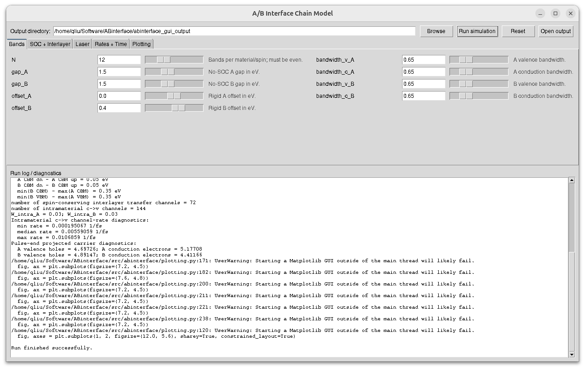

# ABinterface

ABinterface is a Python-based density-matrix toy model for short-time laser-driven carrier and spin redistribution at a non-matching A/B material interface.

The software is intended for qualitative mechanism analysis.  It is not a first-principles TDDFT, BSE, Boltzmann transport, or microscopic scattering code. 
The model is useful for testing how elementary optical excitation, material spin-orbit coupling, and interlayer transfer combine to produce projected occupation changes.
The default dynamics is therefore coherent and unitary.

The code **does not hard-code a single sequential trajectory** such as

```text
A_v up -> A_c up -> A_c down -> B_c down -> B_v down
```

Instead, it propagates a one-particle density matrix under a Hamiltonian containing 
elementary coherent channels:

1. Intramaterial optical excitation, `X_v s <-> X_c s`;
2. material-internal SOC-derived signed diagonal splitting;
3. material-internal SOC up/down mixing;
4. same-spin-label interlayer hopping, `A_c s <-> B_c s`, with optional `A_v s <-> B_v s`.

A chain-like population pattern is an emergent interpretation of projected occupations, 
not an imposed algorithmic path.

## Package layout

```text
ABinterface/
  basis.py          basis indexing and projections
  bands.py          non-matching A/B no-SOC energies plus signed SOC splitting
  laser.py          laser pulse and optical matrix elements
  hamiltonian.py    material SOC, interlayer hopping, and laser Hamiltonian
  density.py        density-matrix initialization and unitary propagation
  observables.py    projected observables
  simulation.py     coherent propagation driver
  plotting.py       plots, CSV output, and textual diagnostics
  cli.py            command-line interface
  gui.py            Tkinter desktop GUI
```

## Installation

```bash
pip install -e .
```

or run without installation from the repository root:

```bash
PYTHONPATH=. python -m ABinterface --help
```
## Documentation

A detailed theoretical and usage manual is available in:

```text
doc/manual.pdf
```

## Example CLI run

```bash
PYTHONPATH=. python -m ABinterface \
  --N 12 \
  --pulse-duration 20 \
  --t-final 70 \
  --dt 0.02 \
  --carrier full \
  --omega-eV 2.0 \
  --lambda-soc-A -0.05 \
  --lambda-soc-B -0.05 \
  --soc-mix-cb-A 0.02 \
  --soc-mix-cb-B 0.02 \
  --tAB 0.08 \
  --compare-time-1 22 \
  --compare-time-2 50 \
  --delta-color-scale 0.08 \
  --delta-color-norm linear
```

## Desktop GUI

After installation:

```bash
ABinterface-gui
```

You will see an interface similar to:

```markdown

```

Without installation:

```bash
PYTHONPATH=. python -m ABinterface.gui
```

On Linux, install Tk support if needed:

```bash
sudo apt install python3-tk
```

The GUI exposes the same model parameters as the CLI.  It uses a tabbed layout:

```text
Bands
SOC + Interlayer
Laser
Time
Plotting
```

Each tab uses a compact two-column arrangement.  The top bar contains output
directory selection, **Run simulation**, **Reset**, and **Open output**.  The
**Reset** button restores all parameter widgets to `ModelConfig` defaults.

## Physical model

The one-particle basis is ordered as

```text
A_up, A_down, B_up, B_down
```

with `N` states in each block.  The first `N/2` states are valence-like and the second `N/2` states are conduction-like.

The time-dependent Hamiltonian is

```text
H(t) = H_static + H_laser(t)
```

where

```text
H_static = H_bands + H_SOC_mix + H_interlayer
```
During the pulse, H_laser(t) is active. After the pulse, H_laser(t)=0 and the density matrix continues to evolve coherently under H_static. 
The model does not include phenomenological relaxation or downhill-rate terms.

## Parameter summary

| Parameter group | Parameters | Role |
|---|---|---|
| Band structure | `N`, `gap_A/B`, `offset_A/B`, `bandwidth_v_A/B`, `bandwidth_c_A/B` | Define the no-SOC A/B band ladders and band alignment. |
| SOC | `lambda_soc_A/B`, `soc_mix_cb_A/B`, `soc_mix_vb_A/B` | Define signed diagonal SOC splitting and material-internal up/down mixing. |
| Interlayer hopping | `tAB`, `tAB_vv`, `interface_band_width`, `hybrid_energy_width` | Define spin-conserving A/B hopping and its band-index/energy filters. |
| Laser coupling | `A0`, `omega_eV`, `carrier`, `pulse_duration`, `dA0`, `dB0`, `optical_energy_width_*`, `band_overlap_width` | Define the pulse and intramaterial optical excitation matrix elements. |
| Plotting | `compare_time_*`, `delta_color_scale`, `delta_color_norm`, `level_*` | Define output diagnostics and figure appearance. |

## Outputs

The standard outputs are:

```text
*_projected_material_spin.png
*_pathway_projected_occupations.png
*_projected_spin.png
*_projected_magnetic_moment.png
*_projection_vs_eigen_occupation.png
*_observables.csv
*_state_occupation_change_from_pulse_end_levels.png
*_state_occupation_change_from_pulse_end_levels.csv
```

`*_pathway_projected_occupations.png` is a diagnostic plot for selected projected occupations. 
It helps check whether the coherent elementary channels generate a chain-like 
redistribution pattern.

## Tests

```bash
pip install -e .[dev]
pytest
```
